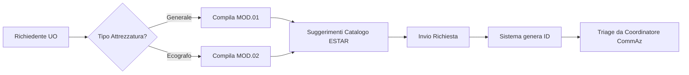

# Workflow Sistema Gestionale Tecnologie Sanitarie
## USL Toscana Nord Ovest - Dipartimento Tecnico

---

## 📋 Indice

1. [Panoramica del Sistema](#panoramica-del-sistema)
2. [Flusso Operativo Completo](#flusso-operativo-completo)
3. [Sistema Multi-Track](#sistema-multi-track)
4. [Workflow di Approvazione](#workflow-di-approvazione)
5. [Ruoli e Responsabilità](#ruoli-e-responsabilità)
6. [Compilazione Moduli](#compilazione-moduli)
7. [Stati della Richiesta](#stati-della-richiesta)
8. [Validazioni e Controlli](#validazioni-e-controlli)

---

## 🎯 Panoramica del Sistema

Il **Gestionale Tecnologie Sanitarie** è un sistema completo per la gestione delle richieste di acquisto, sostituzione e aggiornamento di attrezzature sanitarie, conforme alla normativa vigente (DGR 306/2024, DGR 737/2022) e alla Procedura TS aziendale.

### Caratteristiche Principali

- ✅ **Sistema Multi-Track**: 4 livelli di urgenza (da 24h a 45 giorni)
- ✅ **Sistema di Supporto al Triage**: Assegnazione track da parte del Coordinatore CommAz
- ✅ **Moduli Ufficiali**: MOD.01 (generale), MOD.02 (ecografi), Fast Track e Semplificato
- ✅ **Catalogo ESTAR**: Suggerimenti prezzi in tempo reale
- ✅ **Storico Richieste**: 106 richieste pregresse consultabili
- ✅ **Listino Prezzi**: 88 ordinativi storici come riferimento

### 📝 Quale Modulo Utilizzare?

| Track | Modulo da Compilare | Quando Usarlo |
|-------|---------------------|---------------|
| **Track 1 - Urgenza Critica** | MOD.01 o MOD.02 | Urgenze critiche (safety, blocco servizi) |
| **Track 2 - Fast Track** | **Modulo Fast Track** | Sostituzioni 1:1, convenzioni ESTAR, <€15K |
| **Track 3 - Semplificata** | **Modulo Semplificato** | Donazioni <€50K, ampliamenti, upgrade |
| **Track 4 - HTA Completo** | MOD.01 o MOD.02 | Nuove tecnologie, alto impatto, >€100K |

**Nota importante:**
- **MOD.01**: per tutte le attrezzature sanitarie generali
- **MOD.02**: specifico solo per ecografi
- **Fast Track** e **Semplificato**: moduli dedicati introdotti dall'ADDENDUM Multi-Track

---

## 🔄 Flusso Operativo Completo

### Fase 1: Creazione Richiesta



**Attori:**
- Medico/Infermiere richiedente
- Direttore U.O. (firma autorizzazione)

**Documenti prodotti:**
- MOD.01_TS (attrezzature generali) oppure
- MOD.02_TS (ecografi)

**Tempi:** 15-30 minuti per compilazione

---

### Fase 2: Sistema di Supporto al Triage

Il **Coordinatore della Commissione Aziendale** (Coordinatore CommAz), supportato dal sistema, analizza la richiesta e assegna il **Track** appropriato:

```
┌─────────────────────────────────────────────────────────┐
│                   ALGORITMO DI TRIAGE                    │
├─────────────────────────────────────────────────────────┤
│                                                          │
│  1️⃣  Safety Critica / Blocco Servizio Essenziale?      │
│      └─> TRACK 1 - URGENZA CRITICA (24-48h)            │
│                                                          │
│  2️⃣  Service ESTAR / Consumabili dedicati?             │
│      └─> Verifica Vendor Lock-in                        │
│                                                          │
│  3️⃣  Nuova Tecnologia / Alto Impatto / >€100K?         │
│      └─> TRACK 4 - HTA COMPLETO (30-45gg)              │
│                                                          │
│  4️⃣  Sostituzione 1:1 / <€15K / Convenzione ESTAR?     │
│      └─> TRACK 2 - FAST TRACK (5-7gg)                  │
│                                                          │
│  5️⃣  Donazione <€50K / Espansione dotazione?           │
│      └─> TRACK 3 - SEMPLIFICATA (15-20gg)              │
│                                                          │
│  6️⃣  Default (se non rientra in altri criteri)         │
│      └─> TRACK 4 - HTA COMPLETO                        │
│                                                          │
└─────────────────────────────────────────────────────────┘
```

**Output:**
- Track assegnato (1-4)
- Tempo massimo di completamento
- Workflow di approvazione richiesto
- Alert eventuali (es: violazione DGR 306/2024)

---

## 🚦 Sistema Multi-Track

### Track 1: URGENZA CRITICA
**⏱️ Tempo Max: 24-48 ore**
**🎨 Colore: Rosso (#dc2626)**
**📝 Modulo: MOD.01 (generale) o MOD.02 (ecografi)**

**Criteri:**
- ⚠️ Safety critica per pazienti o operatori
- 🚨 Blocco servizio essenziale (PS, Rianimazione, Sala Operatoria)
- 📋 Obbligo normativo urgente con scadenza imminente

**Workflow Abbreviato:**
```
Richiesta → Triage → Coordinatore CommAz → Direttore Sanitario → Ordine
```

**Esempio:**
> "Guasto ventilatore polmonare in Terapia Intensiva - necessaria sostituzione immediata"

---

### Track 2: FAST TRACK
**⏱️ Tempo Max: 5-7 giorni**
**🎨 Colore: Arancione (#ea580c)**
**📝 Modulo: FAST TRACK (Allegato 2-bis)**

**Criteri:**
- 🔁 Sostituzione 1:1 di attrezzatura esistente
- 💰 Valore <€15.000
- 📑 Convenzione ESTAR attiva
- 🛠️ Manutenzione ordinaria o service attivo

**Workflow:**
```
Richiesta → Triage → Coordinatore CommAz → Direttore Amministrativo → Ordine
```

**Esempio:**
> "Sostituzione ECG carrellato rotto, stesso modello in convenzione ESTAR"

---

### Track 3: SEMPLIFICATA
**⏱️ Tempo Max: 15-20 giorni**
**🎨 Colore: Giallo (#ca8a04)**
**📝 Modulo: SEMPLIFICATO (Allegato 2-ter)**

**Criteri:**
- 🎁 Donazione con valore <€50.000
- ✅ Conforme a DGR 306/2024 (no materiali dedicati)
- 📈 Espansione dotazione esistente (non nuova tecnologia)
- 💡 Aggiornamento tecnologico su base già presente

**Workflow:**
```
Richiesta → Triage → CommAz → Direzione Sanitaria → Direzione Amministrativa → Ordine
```

**Esempio:**
> "Donazione 3 monitor multiparametrici per reparto cardiologia, marca già in uso"

---

### Track 4: HTA COMPLETO
**⏱️ Tempo Max: 30-45 giorni**
**🎨 Colore: Blu (#2563eb)**
**📝 Modulo: MOD.01 (generale) o MOD.02 (ecografi)**

**Criteri:**
- 🆕 Nuova tecnologia mai utilizzata in azienda
- 💎 Alto impatto organizzativo/clinico
- 💰 Investimento >€100.000
- 🎁 Donazione >€50.000
- 📊 Richiede valutazione HTA completa

**Workflow Completo:**
```
Richiesta → Triage →
UO Richiedente (istruttoria) →
Dipartimento (valutazione tecnica) →
Commissione Aziendale HTA (valutazione multidisciplinare) →
Direzione Sanitaria (parere clinico) →
Direzione Amministrativa (sostenibilità economica) →
Ordine
```

**Valutazione HTA include:**
- 🔬 Evidence scientifica (efficacia, sicurezza)
- 💰 Analisi economica (costi diretti/indiretti, ROI)
- ⚖️ Impatto organizzativo (spazi, personale, formazione)
- 📜 Aspetti normativi e etici
- 🏥 Impatto sulla rete dei servizi

**Esempio:**
> "Introduzione robot chirurgico Da Vinci per chirurgia mini-invasiva - investimento €1.8M"

---

## ✅ Workflow di Approvazione

### Stati della Richiesta

```
SOTTOMESSA
    ↓
IN_TRIAGE (sistema assegna Track)
    ↓
IN_VALUTAZIONE_UO (raccolta info aggiuntive)
    ↓
IN_VALUTAZIONE_DIPARTIMENTO (parere tecnico)
    ↓
IN_COMMISSIONE_HTA (valutazione multidisciplinare)
    ↓
IN_VALUTAZIONE_DS (Direzione Sanitaria)
    ↓
IN_VALUTAZIONE_DA (Direzione Amministrativa)
    ↓
APPROVATA
    ↓
IN_PROCUREMENT (gara/trattativa/ordine)
    ↓
COMPLETATA
```

### Stati di Eccezione

- ❌ **RESPINTA**: Non approvata (motivazione obbligatoria)
- ⏸️ **SOSPESA**: In attesa integrazioni
- 🔄 **RIASSEGNATA**: Cambiato Track dopo rivalutazione

---

## 👥 Ruoli e Responsabilità

### 1. Richiedente (Medico/Infermiere)
**Responsabilità:**
- ✍️ Compilare il modulo (MOD.01 o MOD.02)
- 📋 Fornire dati tecnici e giustificazione clinica
- 📞 Rispondere a richieste di integrazione

**Accesso Sistema:**
- Compilazione moduli
- Consultazione storico richieste
- Visualizzazione catalogo ESTAR

---

### 2. Direttore U.O.
**Responsabilità:**
- ✅ Autorizzare la richiesta con firma
- 🎯 Validare la priorità indicata
- 💼 Garantire sostenibilità organizzativa

**Accesso Sistema:**
- Visualizzazione richieste della propria UO
- Approvazione/rifiuto richieste
- Dashboard UO

---

### 3. Coordinatore Commissione Aziendale HTA
**Responsabilità:**
- 🎯 Supervisionare il triage automatico
- 📊 Coordinare le valutazioni multidisciplinari
- ⚡ Gestire le priorità in caso di conflitti

**Accesso Sistema:**
- Dashboard completa tutte le richieste
- Modifica Track se necessario
- Assegnazione valutatori

---

### 4. Coordinatore CommAz / Responsabile HTA
**Figura chiave del sistema multi-track**

**Responsabilità:**
- 🎯 **Triage di tutte le richieste** e assegnazione al track appropriato
- 🔍 Pre-screening tecnico-economico
- ✅ Verifica eligibilità per Fast Track e Procedura Semplificata
- 📋 Coordinamento lavori della Commissione Aziendale per Track 3 e 4
- 📊 Mantenimento registro tracciabilità richieste
- 📈 Condurre valutazioni HTA complete (Track 4)
- 📊 Produrre report trimestrali alla Direzione
- 🤝 Coordinare esperti esterni

**Accesso Sistema:**
- Dashboard di tutte le richieste in ingresso
- Sistema di assegnazione track
- Registro tracciabilità richieste
- Template report HTA
- Database evidence scientifica

---

### 5. Direzione Sanitaria
**Responsabilità:**
- 🏥 Valutare impatto clinico-assistenziale
- ✅ Approvare richieste >€50K
- 🎯 Definire priorità strategiche

**Accesso Sistema:**
- Dashboard direzionale
- Tutte le richieste in valutazione DS
- Report aggregati

---

### 6. Direzione Amministrativa
**Responsabilità:**
- 💰 Valutare sostenibilità economica
- ✅ Approvazione finale per ordini
- 📊 Monitoraggio budget

**Accesso Sistema:**
- Dashboard economica
- Richieste in valutazione DA
- Report budget e spesa

---

### 7. Ufficio Acquisizioni
**Responsabilità:**
- 🛒 Gestire gare e procedure di acquisto
- 📑 Verificare convenzioni ESTAR
- 📦 Emettere ordini

**Accesso Sistema:**
- Richieste approvate da processare
- Catalogo fornitori
- Storico ordinativi

---

## 📝 Compilazione Moduli

### MOD.01 - Richiesta Attrezzature Generali

**Sezioni obbligatorie:**

1️⃣ **Richiedente e Collocazione**
   - Nome, telefono, email
   - Reparto destinatario
   - Presidio utilizzo

2️⃣ **Tecnologia Richiesta**
   - Descrizione attrezzatura
   - Quantità
   - Caratteristiche tecniche principali
   - Procedura/diagnosi principale
   - Prestazioni annue previste
   - ✨ **Suggerimenti automatici prezzi da Catalogo ESTAR**

3️⃣ **Motivo Acquisizione**
   - ➕ Incremento tecnologico
   - 🔄 Sostituzione (indicare COD fuori uso)
   - ⬆️ Aggiornamento

4️⃣ **Necessità Accessorie**
   - Risorse umane necessarie
   - Modifiche strutturali
   - Formazione richiesta

5️⃣ **Aspetti Contrattuali**
   - 💰 Acquisto (stima costo IVA esclusa)
   - 📄 Leasing (durata mesi)
   - 🛠️ Service (durata mesi)
   - 🏢 Noleggio (durata mesi)
   - **Input con formato italiano**: 1.234,56 €

6️⃣ **Note**
   - Informazioni aggiuntive

**⏱️ Tempo compilazione: 15-20 minuti**

---

### MOD.02 - Richiesta Ecografi

**Sezioni aggiuntive specifiche:**

🔊 **Trasduttori Richiesti**
   - Tabella dinamica (aggiungi/rimuovi righe)
   - Tipologia e quantità per ogni trasduttore

👨‍⚕️ **Personale Medico**
   - Lista medici che utilizzeranno l'ecografo
   - Fino a 12 nominativi

🏥 **Tipologia Attività**
   - Mono-specialistica / Multi-specialistica
   - Specificare discipline

📊 **Valutazione Fabbisogno**
   - Provenienza utenza
   - Modalità accesso (CUP, urgenza, altro)
   - Volumi attività attuali e previsti
   - Possibilità prenotazione CUP

📦 **Apparecchiature Esistenti**
   - Inventario ecografi già presenti
   - Tabella: N° inventario, Marca, Modello, Trasduttori

**⏱️ Tempo compilazione: 25-35 minuti**

---

## 🎨 Stati della Richiesta (Dettaglio)

### SOTTOMESSA
**Descrizione:** Richiesta appena inviata dal richiedente
**Colore:** Grigio
**Azioni possibili:**
- Visualizzare dettagli
- Annullare (solo richiedente)

---

### IN_TRIAGE
**Descrizione:** Sistema sta analizzando la richiesta per assegnare il Track
**Colore:** Giallo
**Durata:** Automatico (< 1 minuto)
**Azioni automatiche:**
- Analisi criteri urgenza
- Verifica convenzioni ESTAR
- Controllo DGR 306/2024
- Assegnazione Track

---

### IN_VALUTAZIONE_UO
**Descrizione:** U.O. richiedente sta completando la documentazione
**Colore:** Arancione
**Attori:** Direttore U.O.
**Azioni possibili:**
- Integrare documentazione
- Approvare e passare allo step successivo
- Respingere

---

### IN_VALUTAZIONE_DIPARTIMENTO
**Descrizione:** Dipartimento sta valutando gli aspetti tecnici
**Colore:** Blu chiaro
**Attori:** Direttore Dipartimento
**Documenti richiesti:**
- Parere tecnico
- Valutazione alternative

---

### IN_COMMISSIONE_HTA
**Descrizione:** Commissione Aziendale HTA sta valutando
**Colore:** Viola
**Attori:** Membri CommAz
**Durata media:** 7-15 giorni (Track 4)
**Output:** Report HTA con raccomandazione

---

### IN_VALUTAZIONE_DS
**Descrizione:** Direzione Sanitaria sta valutando
**Colore:** Verde chiaro
**Attori:** Direttore Sanitario / Delegato
**Valutazione:** Impatto clinico-assistenziale

---

### IN_VALUTAZIONE_DA
**Descrizione:** Direzione Amministrativa sta valutando
**Colore:** Azzurro
**Attori:** Direttore Amministrativo / Delegato
**Valutazione:** Sostenibilità economica, copertura budget

---

### APPROVATA
**Descrizione:** Richiesta approvata, pronta per procurement
**Colore:** Verde
**Azioni successive:**
- Verifica convenzioni
- Avvio gara (se necessario)
- Emissione ordine

---

### IN_PROCUREMENT
**Descrizione:** In fase di acquisto/gara
**Colore:** Blu scuro
**Attori:** Ufficio Acquisizioni
**Sub-stati:**
- Verifica convenzioni ESTAR
- Preparazione documentazione gara
- Pubblicazione bando
- Valutazione offerte
- Aggiudicazione
- Emissione ordine

---

### COMPLETATA
**Descrizione:** Ordine emesso, processo concluso
**Colore:** Verde scuro
**Informazioni archiviate:**
- Fornitore selezionato
- Prezzo finale
- N° ordine e data
- Tempi effettivi di completamento

---

### RESPINTA
**Descrizione:** Richiesta non approvata
**Colore:** Rosso
**Motivazione:** Obbligatoria
**Possibilità ricorso:** Sì, con integrazione documentazione

---

### SOSPESA
**Descrizione:** In attesa di integrazioni/chiarimenti
**Colore:** Giallo ocra
**Timer:** In pausa (giorni non conteggiati)
**Riattivazione:** Automatica al ricevimento integrazioni

---

## ✅ Validazioni e Controlli

### DGR 306/2024 - Donazioni

**Controllo automatico:**
```javascript
if (richiesta.donazione && richiesta.donazione.materialiUsoDecicati) {
  ❌ BLOCCO: "Violazione DGR 306/2024"
  📋 Motivazione: "Vietate donazioni con materiale d'uso dedicato"
}
```

**Eccezioni ammesse:**
- Donazioni senza materiali dedicati
- Donazioni con clausola cessione gratuita consumabili (tempo limitato)

---

### Service e Consumabili - Vendor Lock-in

**Alert generato se:**
- Service esclusivo con un solo fornitore
- Consumabili proprietari non compatibili
- Vincolo >3 anni senza possibilità recesso

**Raccomandazione:**
- Preferire soluzioni multi-vendor
- Clausole di recesso anticipato
- Compatibilità con consumabili di mercato

---

### Convenzioni ESTAR

**Verifica automatica:**
- Esistenza convenzione attiva
- Fornitore in convenzione
- Prezzo in linea con massimale
- Scadenza convenzione

**Suggerimento:** Se convenzione disponibile → Track 2 (Fast Track)

---

## 📊 Dashboard e Report

### Dashboard Operativa

**Per Richiedente:**
- 📋 Mie richieste (stato, tempi)
- ⏱️ Tempo medio approvazione
- 📈 Storico richieste approvate/respinte

**Per Direttore U.O.:**
- 📊 Richieste della mia U.O.
- 💰 Budget utilizzato/disponibile
- 🎯 Priorità in gestione

**Per Direzione:**
- 📈 Tutte le richieste per Track
- ⚠️ Alert scadenze
- 💰 Analisi budget
- 📊 Statistiche per U.O./Dipartimento

---

### Report Trimestrali

**Contenuti:**
- 📊 Richieste gestite per Track
- ⏱️ Tempi medi per Track
- 💰 Budget impegnato per categoria
- 🎯 Tasso di approvazione
- 🚨 Colli di bottiglia identificati
- 📈 Trend e previsioni

---

## 🎓 FAQ e Casi d'Uso

### Caso 1: ECG Rotto in Pronto Soccorso

**Situazione:** ECG carrellato guasto in PS, necessaria sostituzione urgente

**Azioni:**
1. Richiedente compila **MOD.01**
2. Motivo: "Sostituzione"
3. Indica COD fuori uso
4. Sistema rileva: Safety critica + Blocco servizio essenziale
5. **Triage automatico → Track 1 (24-48h)**
6. Workflow: Triage → Coordinatore CommAz → DS → Ordine
7. Tempo totale: **36 ore**

---

### Caso 2: Ecografo Donato da Associazione

**Situazione:** Associazione vuole donare ecografo da €35.000

**Azioni:**
1. Richiedente compila **MOD.02**
2. Tipo: "Incremento" (donazione)
3. Verifica: Nessun materiale uso dedicato ✅
4. **Triage automatico → Track 3 (15-20gg)**
5. Workflow: Triage → CommAz → DS → DA → Ordine accettazione
6. Tempo totale: **18 giorni**

---

### Caso 3: Robot Chirurgico Da Vinci

**Situazione:** Richiesta nuovo robot chirurgico (€1.8M)

**Azioni:**
1. Richiedente compila **MOD.01**
2. Motivo: "Incremento" (nuova tecnologia)
3. Sistema rileva: Nuova tecnologia + Alto impatto + >€100K
4. **Triage automatico → Track 4 HTA Completo (30-45gg)**
5. Workflow completo con valutazione HTA
6. Report HTA include:
   - Evidence scientifica
   - Analisi costi-benefici
   - Impatto organizzativo (formazione, spazi, team)
   - Sostenibilità economica pluriennale
7. Tempo totale: **42 giorni**

---

## 📞 Supporto e Contatti

**Ufficio Acquisizioni Attrezzature Sanitarie**
📧 Email: acquisizione.attrezzaturesanitarie@uslnordovest.toscana.it
📞 Telefono: [inserire numero]

**Coordinatore Commissione HTA**
📧 Email: [inserire email]

**Supporto Tecnico Sistema**
📧 Email: [inserire email]
🌐 Documentazione: /docs

---

## 📅 Versione e Aggiornamenti

**Versione documento:** 1.0
**Data:** Dicembre 2024
**Ultimo aggiornamento:** 22/12/2024
**Conforme a:**
- Procedura TS revisionata
- DGR 306/2024 (Donazioni)
- DGR 737/2022 (HTA)
- ADDENDUM Multi-Track
- ADDENDUM Service/Consumabili

---

*Documento generato dal Sistema Gestionale Tecnologie Sanitarie - USL Toscana Nord Ovest*
